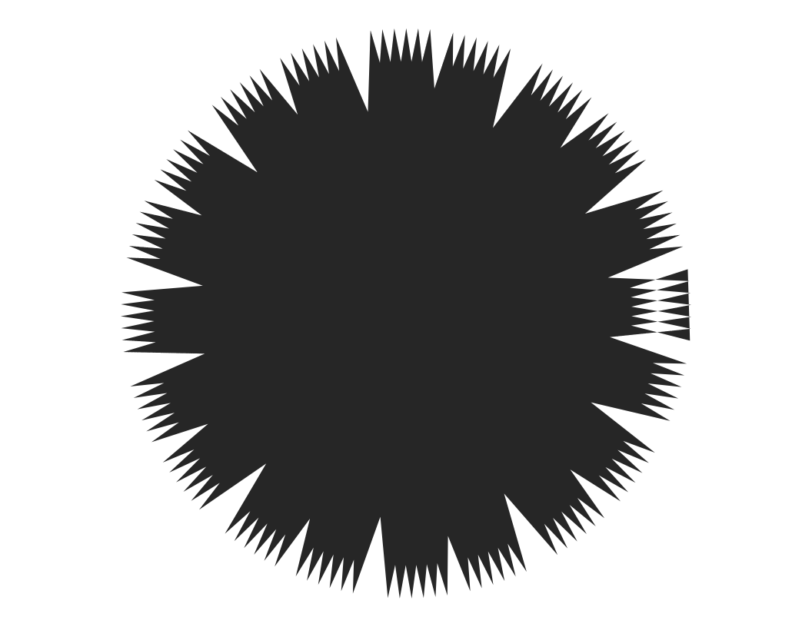

Vertigo
================
Robert A. Stevens
2024-07-20

``` r
# import libraries
library(tidyverse)
```

    ── Attaching core tidyverse packages ──────────────────────── tidyverse 2.0.0 ──
    ✔ dplyr     1.1.4     ✔ readr     2.1.5
    ✔ forcats   1.0.0     ✔ stringr   1.5.1
    ✔ ggplot2   3.5.1     ✔ tibble    3.2.1
    ✔ lubridate 1.9.3     ✔ tidyr     1.3.1
    ✔ purrr     1.0.2     
    ── Conflicts ────────────────────────────────────────── tidyverse_conflicts() ──
    ✖ dplyr::filter() masks stats::filter()
    ✖ dplyr::lag()    masks stats::lag()
    ℹ Use the conflicted package (<http://conflicted.r-lib.org/>) to force all conflicts to become errors

``` r
n <- 120

tibble(
  x = accumulate(1:n, ~.x + cos(.y * (pi)^10), .init=0),
  y = accumulate(1:n, ~.x + sin(.y * (pi)^10), .init=0)
) %>%
  ggplot(aes(x, y)) +
    geom_polygon() +
    coord_equal() +
    theme_void()
```

<!-- -->

Source:

Antonio Sánchez Chinchón @aschinchon

<https://twitter.com/> \[2020-08-19\]

`#maths #rstats #generative`
