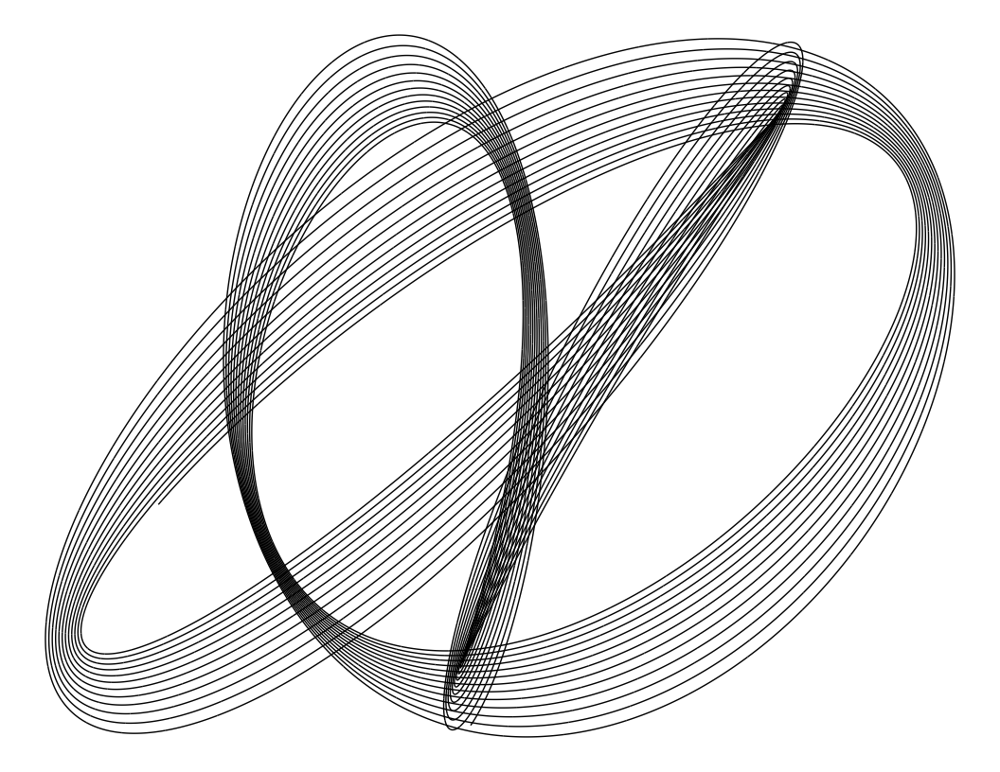

chaos
================
Robert A. Stevens
2024-07-23

Got a better name?

``` r
# import libraries
library(tidyverse)
```

    ── Attaching core tidyverse packages ──────────────────────── tidyverse 2.0.0 ──
    ✔ dplyr     1.1.4     ✔ readr     2.1.5
    ✔ forcats   1.0.0     ✔ stringr   1.5.1
    ✔ ggplot2   3.5.1     ✔ tibble    3.2.1
    ✔ lubridate 1.9.3     ✔ tidyr     1.3.1
    ✔ purrr     1.0.2     
    ── Conflicts ────────────────────────────────────────── tidyverse_conflicts() ──
    ✖ dplyr::filter() masks stats::filter()
    ✖ dplyr::lag()    masks stats::lag()
    ℹ Use the conflicted package (<http://conflicted.r-lib.org/>) to force all conflicts to become errors

``` r
h <- function(t, a, b, d, e) exp(-a * t) * sin(t * b + 3) + exp(-d * t) * sin(t * e + 1)
f <- sample(2:3, 4, TRUE)
d <- runif(4, 0, 0.01)

seq(1, 80, 0.0005) %>%
  data.frame(., x=h(., d[1], f[1], d[2], f[2]), y=h(., d[3], f[3], d[4], f[4])) %>%
  ggplot(aes(x, y)) +
    geom_path() +
    theme_void()
```

<!-- -->

Source:

Antonio S. Chinchón @aschinchon

<https://twitter.com/> \[2018-08-25\]
