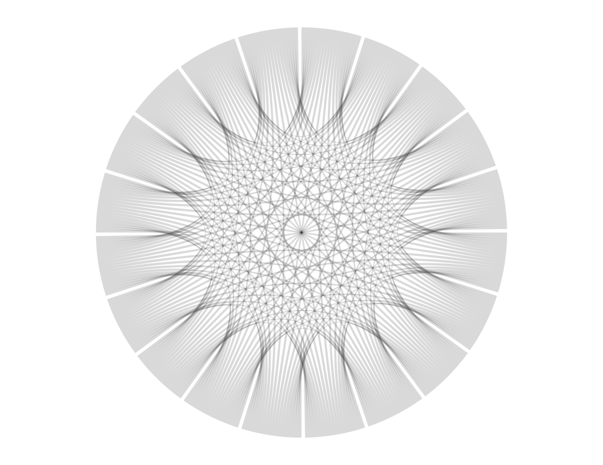

chord Diagram 2
================
Robert A. Stevens
2024-07-23

Got a better name?

``` r
# import libraries
library(circlize)
```

    ========================================
    circlize version 0.4.16
    CRAN page: https://cran.r-project.org/package=circlize
    Github page: https://github.com/jokergoo/circlize
    Documentation: https://jokergoo.github.io/circlize_book/book/

    If you use it in published research, please cite:
    Gu, Z. circlize implements and enhances circular visualization
      in R. Bioinformatics 2014.

    This message can be suppressed by:
      suppressPackageStartupMessages(library(circlize))
    ========================================

``` r
par(mar=c(1, 1, 1, 1))

chordDiagram(
  matrix(1, 20, 20),
  col="black",
  symmetric=TRUE,
  transparency=0.85,
  annotationTrack=NULL
)
```

<!-- -->

Source:

Antonio S. Chinchón @aschinchon

<https://twitter.com/> \[2018-08-21\]
