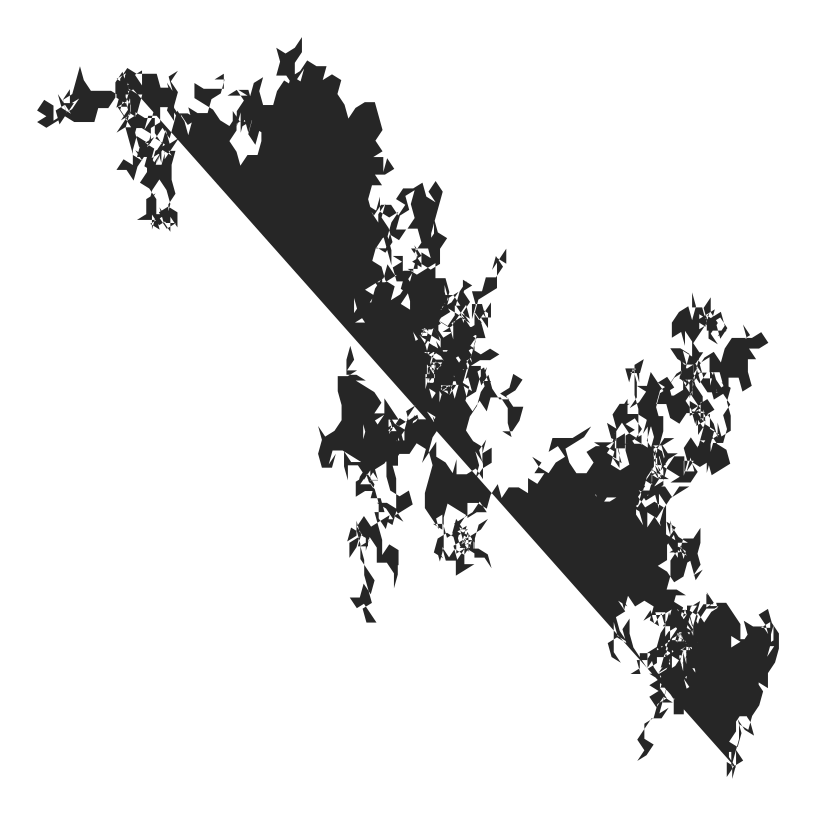

fractal_1
================
Robert A. Stevens
2024-07-20

Got a better name?

``` r
# import libraries
library(ggplot2)
```

``` r
n <- 2500

df <- data.frame(x=0, y=0)

for (i in 2:n) {
  a <- sample(0:15, 1)
  df[i, 1] <- df[i - 1, 1] + (cos(pi / 8 * a))
  df[i, 2] <- df[i - 1, 2] + (sin(pi / 8 * a))
}

ggplot(df, aes(x, y)) +
  geom_polygon() +
  theme_void()
```

<!-- -->

Source:

Antonio S. Chinchón @aschinchon

<https://twitter.com/> \[2018-08-16\]
