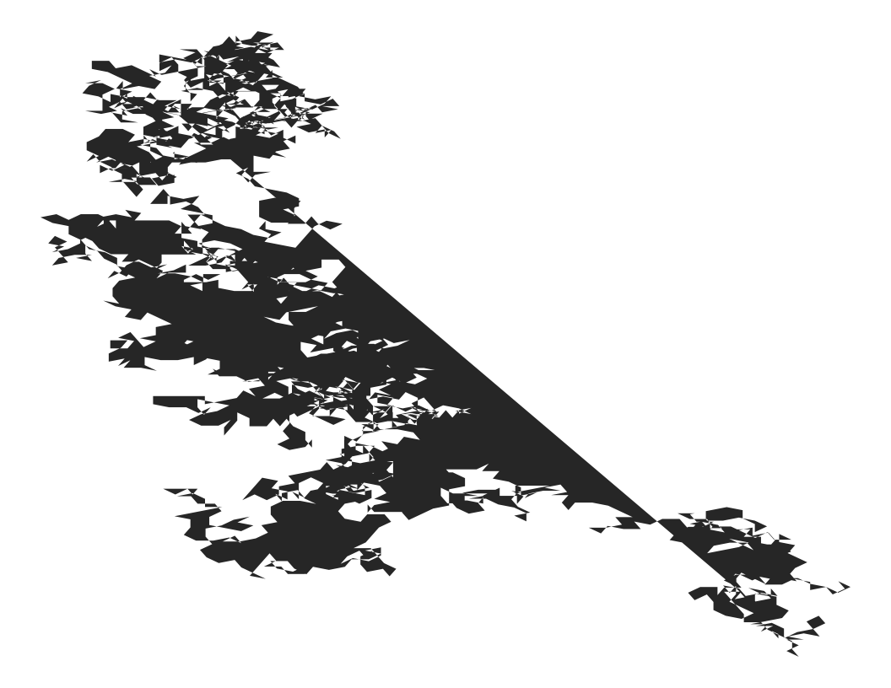

fractal 2
================
Robert A. Stevens
2024-07-23

Got a better name?

Without explicit loop:

``` r
# import libraries
library(tidyverse)
```

    ── Attaching core tidyverse packages ──────────────────────── tidyverse 2.0.0 ──
    ✔ dplyr     1.1.4     ✔ readr     2.1.5
    ✔ forcats   1.0.0     ✔ stringr   1.5.1
    ✔ ggplot2   3.5.1     ✔ tibble    3.2.1
    ✔ lubridate 1.9.3     ✔ tidyr     1.3.1
    ✔ purrr     1.0.2     
    ── Conflicts ────────────────────────────────────────── tidyverse_conflicts() ──
    ✖ dplyr::filter() masks stats::filter()
    ✖ dplyr::lag()    masks stats::lag()
    ℹ Use the conflicted package (<http://conflicted.r-lib.org/>) to force all conflicts to become errors

``` r
data_frame(
  z = c(0, sample(0:15, 2499, TRUE)),
  x = accumulate(z, ~.x + cos(pi / 8 * .y)),
  y = accumulate(z, ~.x + sin(pi / 8 * .y))
) %>%
  ggplot(aes(x, y)) +
    geom_polygon() +
    theme_void()
```

    Warning: `data_frame()` was deprecated in tibble 1.1.0.
    ℹ Please use `tibble()` instead.
    This warning is displayed once every 8 hours.
    Call `lifecycle::last_lifecycle_warnings()` to see where this warning was
    generated.

<!-- -->

Source:

Antonio S. Chinchón @aschinchon

<https://twitter.com/> \[2018-08-19\]
