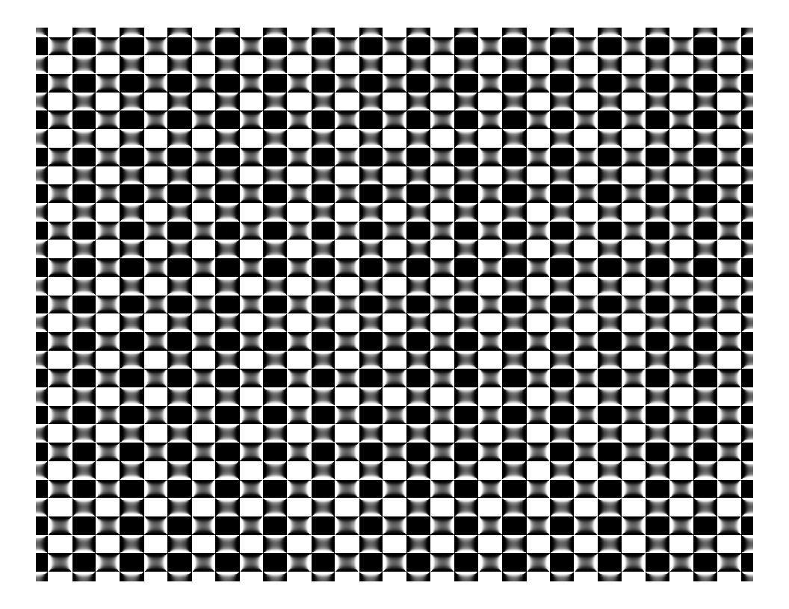

grid
================
Robert A. Stevens
2024-07-23

Got a better name?

``` r
# import libraries
library(dplyr)
```


    Attaching package: 'dplyr'

    The following objects are masked from 'package:stats':

        filter, lag

    The following objects are masked from 'package:base':

        intersect, setdiff, setequal, union

``` r
library(ggplot2)
library(pracma)
```

``` r
seq(-15*pi, 15*pi, by=0.1) %>%
  expand.grid(x=., y=.) %>%
  ggplot(aes(x=x, y=y, fill=erf(sec(x) - sec(y)))) +
    geom_tile() +
    scale_fill_gradientn(colours=c("#000000", "#FFFFFF")) +
    theme_void() +
    theme(legend.position="none")
```

<!-- -->

Source:

Antonio S. Chinchón @aschinchon

<https://twitter.com/> \[2018-08-20\]
