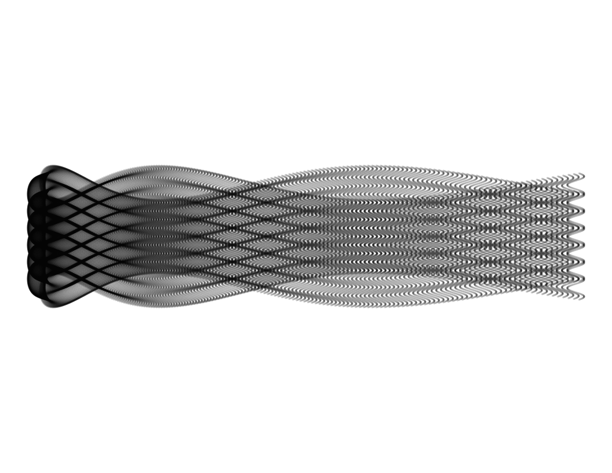

waves
================
Robert A. Stevens
2024-07-23

Got a better name?

``` r
# import libraries
library(dplyr)
```


    Attaching package: 'dplyr'

    The following objects are masked from 'package:stats':

        filter, lag

    The following objects are masked from 'package:base':

        intersect, setdiff, setequal, union

``` r
library(ggplot2)
```

``` r
seq(from=-10, to=10, by = 0.05) %>%
  expand.grid(x=., y=.) %>%
  ggplot(aes(x=(x^2+ pi * cos(y)^2), y=(y + pi * sin(x)))) +
    geom_point(alpha=.1, shape=20, size=1, color="black") +
    theme_void() +
    coord_fixed()
```

<!-- -->

Source:

Antonio S. Chinchón @aschinchon

<https://twitter.com/> \[2018-08-19\]
